# OpenOptions

[](LICENSE)
[](#requirements)
[](agent)
[](ui)
[](#features)

Third-party configuration app for the MX Master 3S and MX Keys S on Linux. It brings full
device configuration to GNOME, KDE and other desktops: button and key assignments, gestures,
thumb wheel actions, SmartShift, DPI, smart backlighting, Easy-Switch and per-application
profiles.

OpenOptions is an independent project. It is not affiliated with, endorsed by, or supported by
the manufacturer of these devices. The device pictures in the app are the author's own and are
part of this repository under its license.

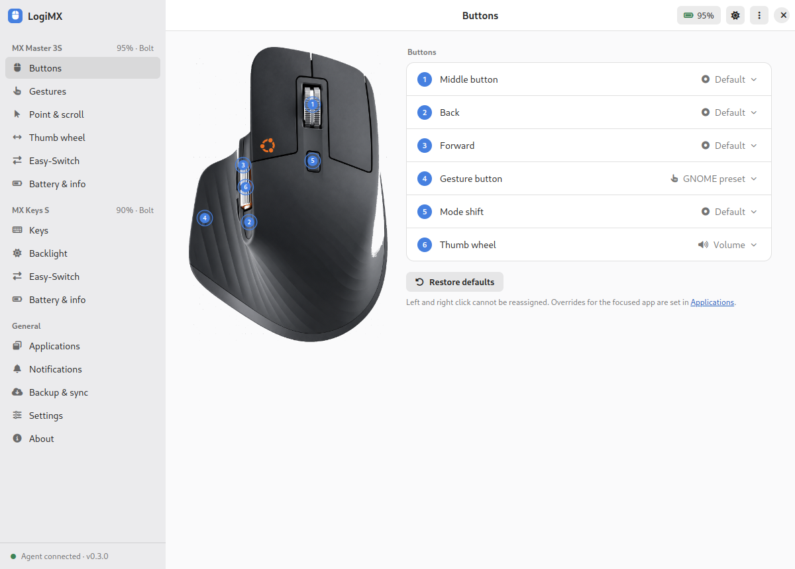

## How it is built

A native agent owns the devices in the background; the desktop UI talks to it over a local socket.

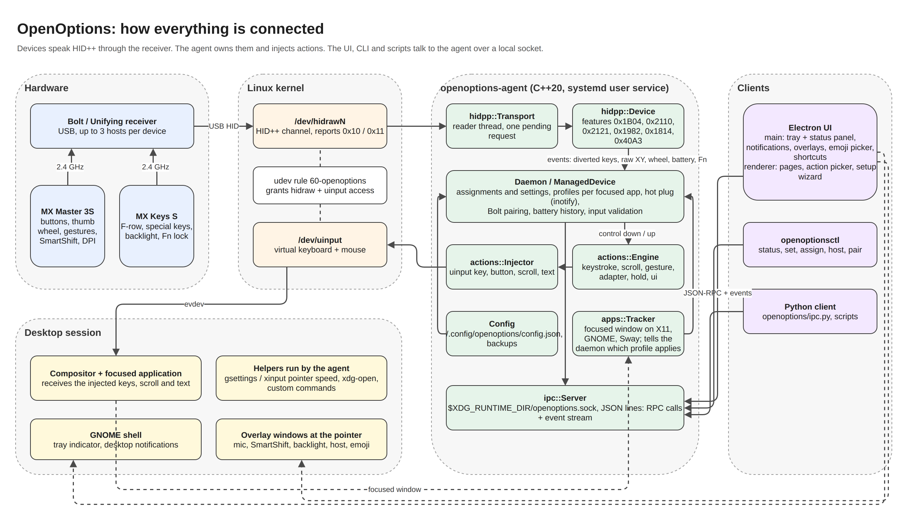

The diagram source is [docs/architecture.drawio](docs/architecture.drawio) (open it with draw.io / diagrams.net);
an SVG export is in [docs/architecture.svg](docs/architecture.svg).

```
agent/          C++20 agent. HID++ 1.0/2.0 over hidraw, uinput for actions, X11 focus tracking,
                JSON RPC over a UNIX socket. No runtime dependencies beyond libc, libstdc++, libX11.
ui/             Electron UI, plain HTML/CSS/JS, talks to the agent over the socket.
openoptions/    Python implementation of the same agent (same RPC and config schema). It was
                written first to validate the protocol against real hardware and is kept as a
                reference and for scripting.
udev/           hidraw and uinput access rule.
systemd/        user service unit for the agent.
```

The agent talks HID++ directly to the receiver or to a Bluetooth device, diverts the controls you
customise so the device sends HID++ events instead of the stock key, and synthesises the desktop
action through a virtual input device. That works the same under X11 and Wayland because it sits
below the compositor.

## Features

Mouse (MX Master 3S)

- Assign any action to the middle, back, forward, gesture and mode shift buttons, with
  numbered callouts on a photo of the device
- Gestures: tap plus four swipe directions on a gesture pad, one-shot or continuous,
  adjustable sensitivity, any movement-capable button can be the gesture button
- Thumb wheel: horizontal or vertical scroll, zoom, volume, tabs, workspaces, brightness,
  direction and speed
- DPI 200 to 8000, desktop pointer speed, SmartShift on/off and sensitivity, a SmartShift
  toggle action, smooth scrolling, natural scroll direction
- Battery with 7-day history, firmware, serial, Easy-Switch host cards with one-click switching

Keyboard (MX Keys S)

- Function row grid and special keys (calculator, capture, menu, lock, dictation, emoji,
  mic mute) with clickable keys on a photo of the keyboard
- Built-in emoji picker: the Emoji key opens a searchable picker at the pointer
  (categories, recents, keyboard navigation), Enter pastes into the focused app
- Smart backlight: on/off, automatic or manual level, hands-away, hands-present and
  on-power timers
- Battery, firmware, Easy-Switch

Everything

- Adwaita-style window with four themes: Light, Dark, Ubuntu, Ubuntu dark
- Action picker with categories, search, a keystroke recorder, shell commands, typed text,
  open URL or folder, launch any installed application
- Per-application profiles with an override view (overridden vs inherited per control),
  suggestions from installed applications
- On-screen overlays when a key changes device state: microphone mute, SmartShift mode,
  backlight level, Easy-Switch host, DPI; position, duration and per-event switches
- Tray indicator with battery levels, Easy-Switch, pause diversion; desktop notifications
  for low battery (threshold configurable) and connect/disconnect
- Global shortcuts: Super+Alt+1..3 switch host, Super+Alt+O toggles overlays,
  Super+Alt+P pauses diversion
- Bolt pairing wizard with passkey confirmation, first-run wizard (permissions with pkexec
  udev install, devices, GNOME / macOS-like / Windows-like presets)
- Backup & sync: automatic daily backups, manual backups, restore, export/import, reset,
  read settings back from the device
- Settings: start at login (systemd user service), tray, close-to-tray, start hidden,
  appearance, update check; About with diagnostics log, export and copy
- Hot plug through inotify; settings re-applied when a device reconnects

## Screenshots

| Gestures | Point and scroll |
|---|---|
| 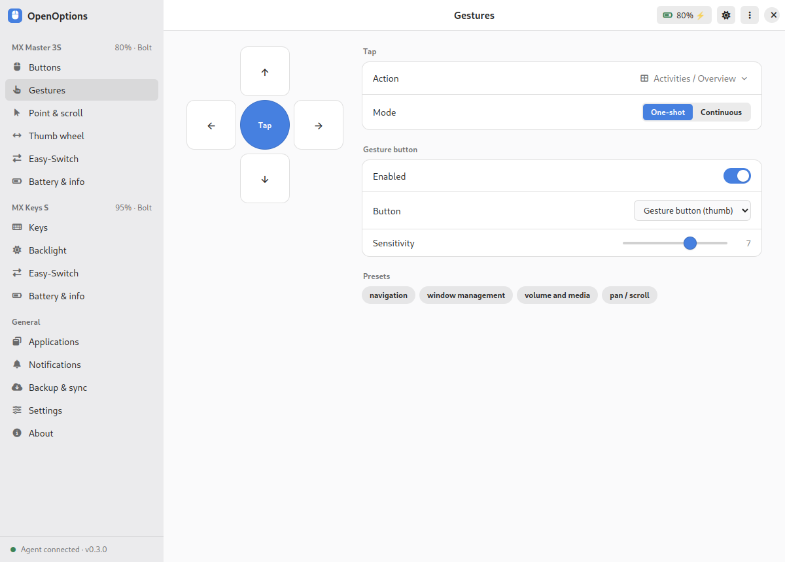 | 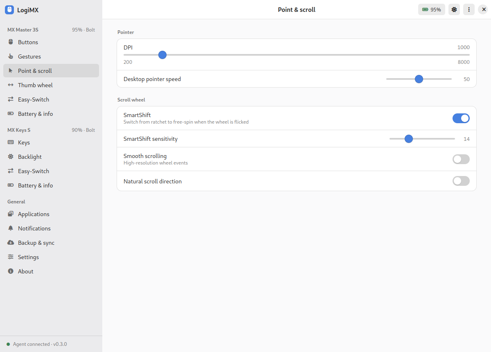 |

| Keyboard | Backlight |
|---|---|
| 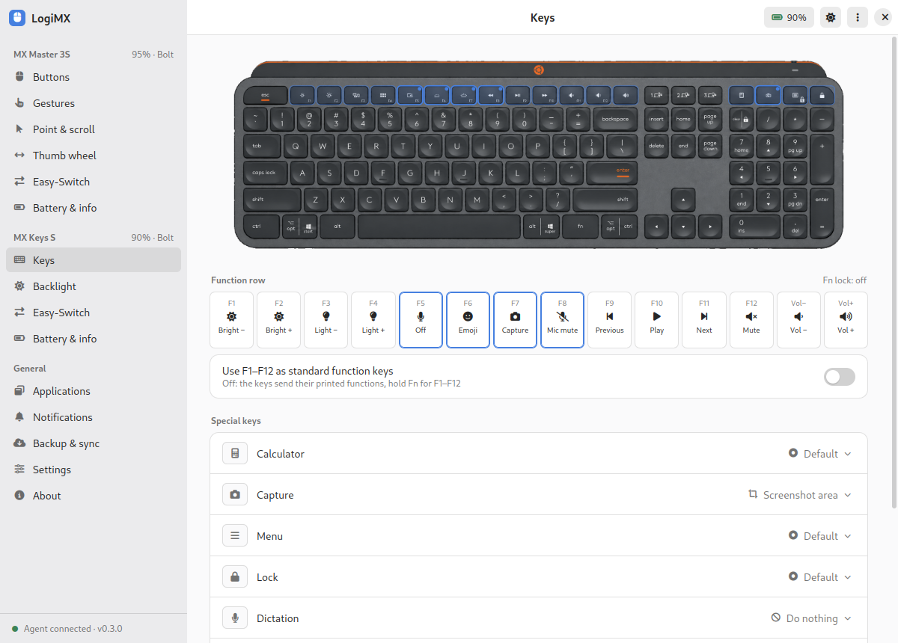 | 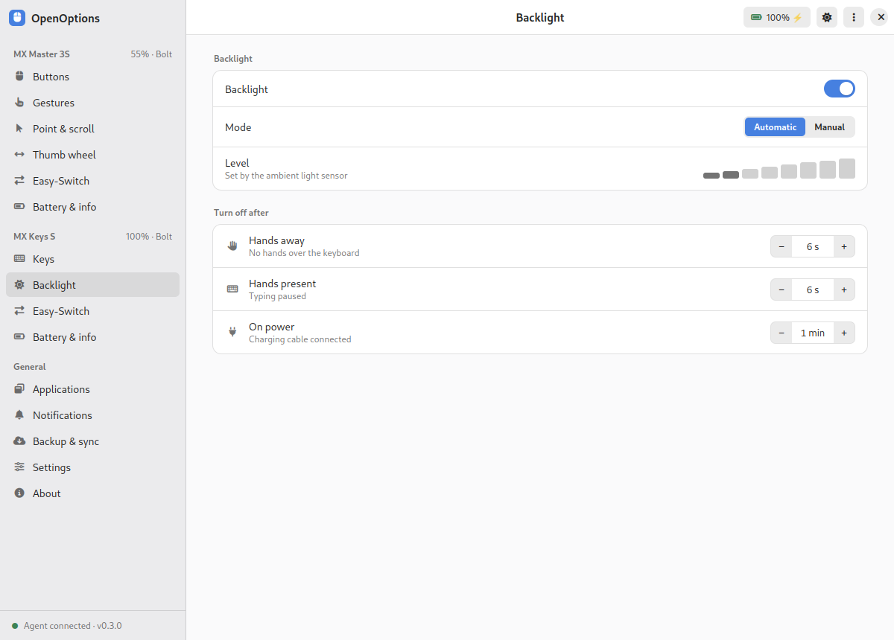 |

| Action picker | Easy-Switch |
|---|---|
| 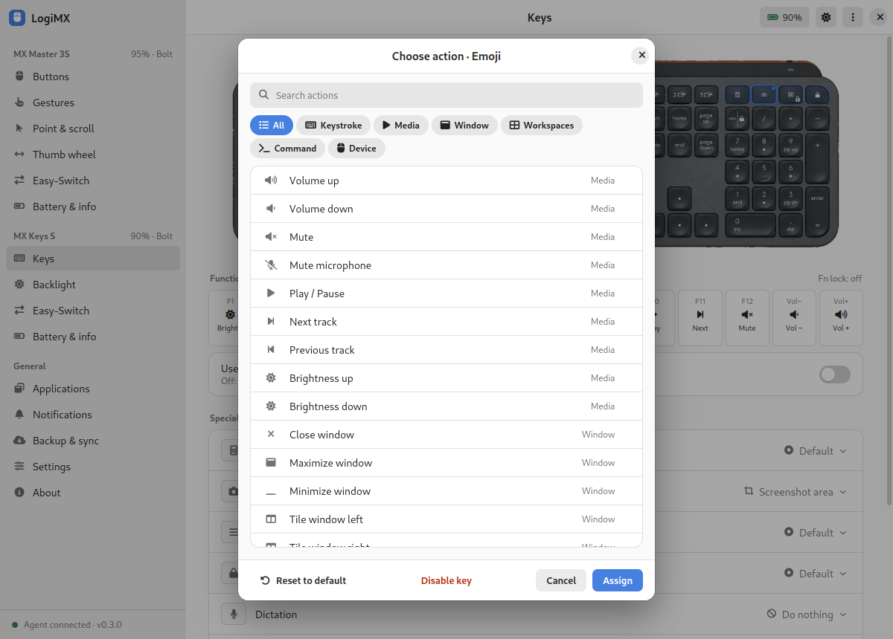 | 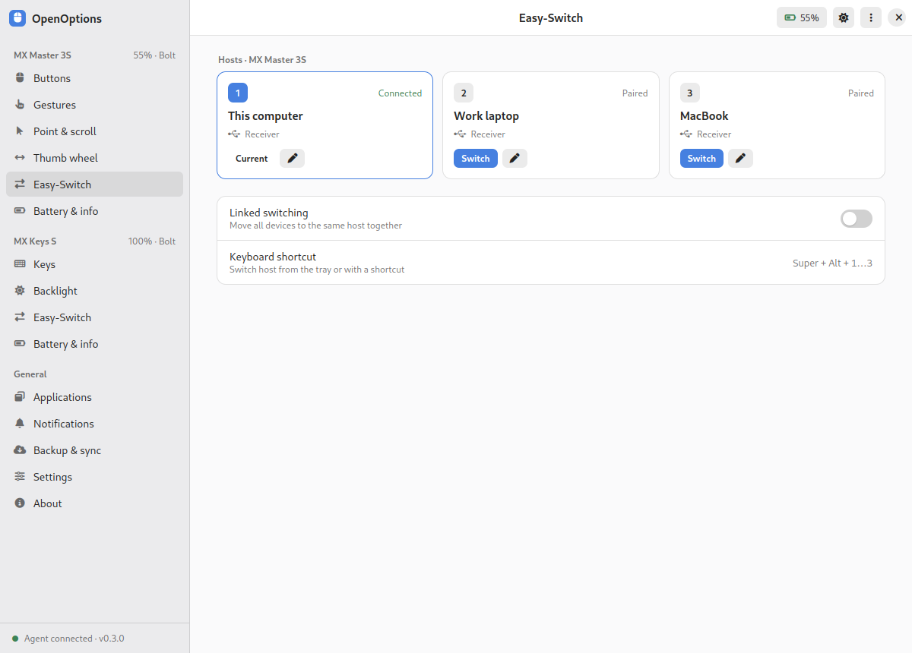 |

| Battery & info | Notifications and overlays |
|---|---|
| 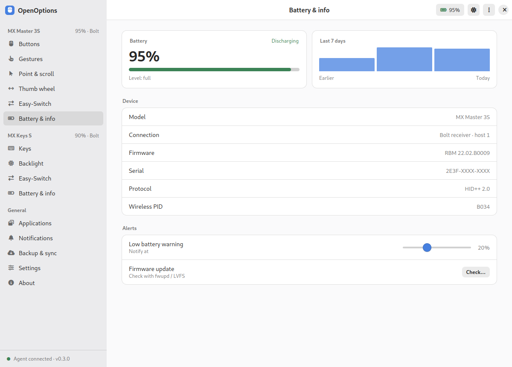 | 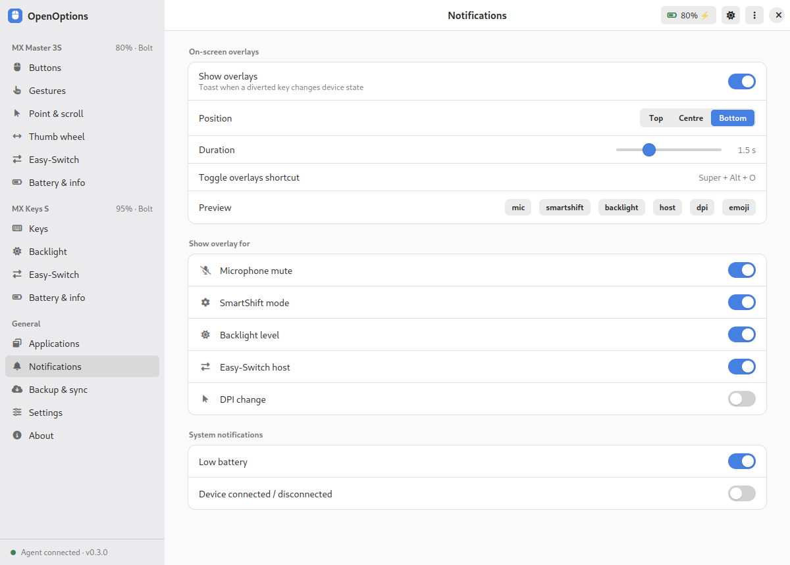 |

| Emoji picker | Tray status panel |
|---|---|
| 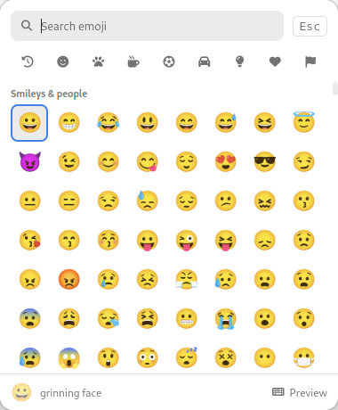 | 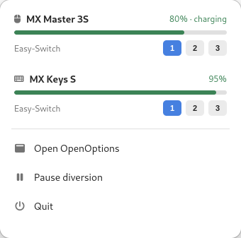 |

| First run | Dark theme |
|---|---|
| 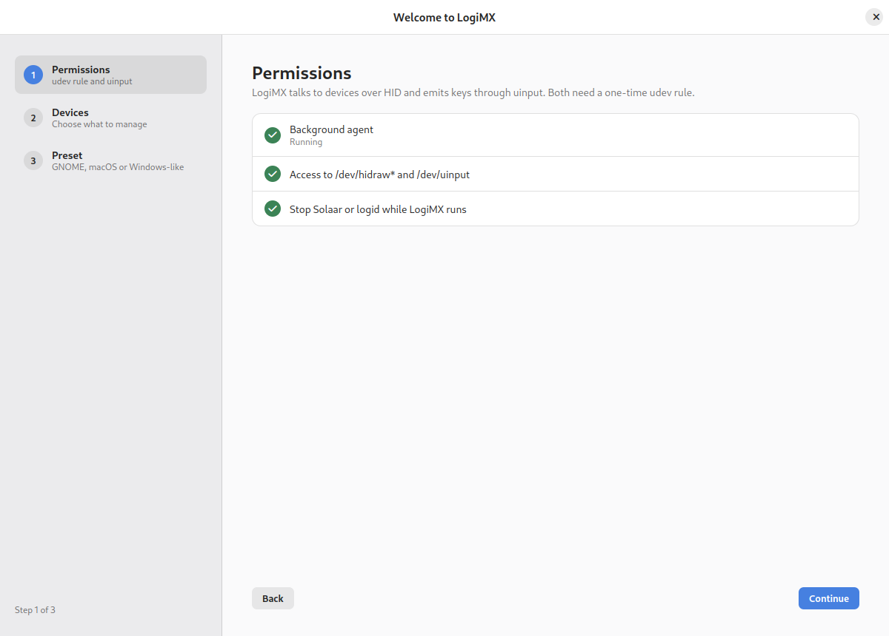 | 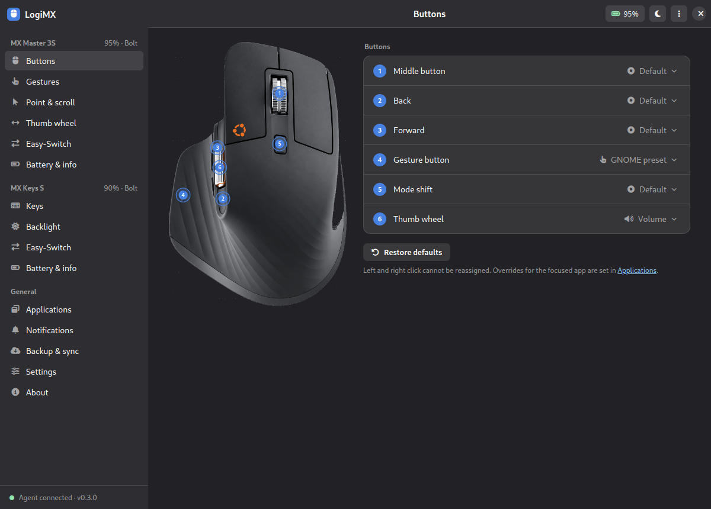 |

| Ubuntu theme | Applications |
|---|---|
| 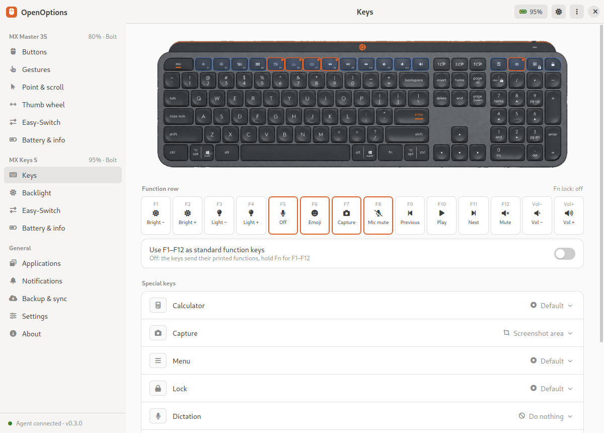 | 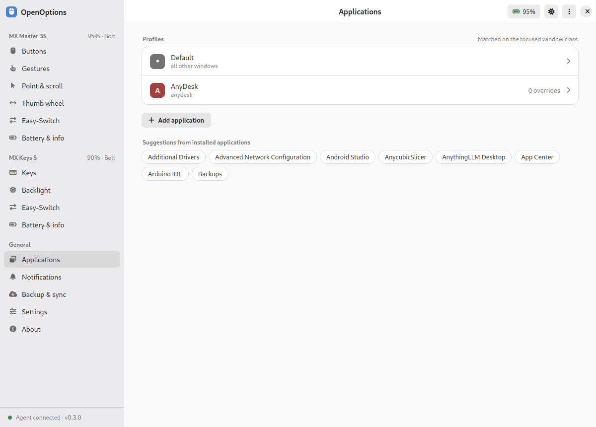 |

## Install

Packages are attached to each [release](https://github.com/aabdelghani/openoptions/releases).

**Debian / Ubuntu (.deb)**: agent, CLI, udev rule, systemd user unit, desktop entry and the app.

```
sudo apt install ./openoptions_0.3.0_amd64.deb
systemctl --user enable --now openoptions      # agent for the current session (automatic after the next login)
openoptions                                    # or launch OpenOptions from the app grid
```

**AppImage**: one file, no installation. The app starts the bundled agent itself and the first-run
wizard installs the udev rule with pkexec.

```
chmod +x OpenOptions-0.3.0-x86_64.AppImage
./OpenOptions-0.3.0-x86_64.AppImage
```

Build the packages yourself with `packaging/deb/build.sh` and `cd ui && npm run dist:appimage`.

## Requirements

- Linux with the kernel's HID++ receiver drivers (built into any mainstream distro)
- g++ 11 or newer, cmake, ninja, libx11-dev
- node 18 or newer for the UI
- Read and write access to `/dev/hidraw*` for the receiver and to `/dev/uinput`
  (`udev/60-openoptions.rules`, or the rule that ships with Solaar)

Stop other tools that divert the same buttons (Solaar, logid) while OpenOptions runs, otherwise
two programs fight over the device. On GNOME the tray icon needs the AppIndicator extension
(`gnome-shell-extension-appindicator`), which Ubuntu ships enabled.

## Quick start (from source)

```
./run-agent.sh -v            # terminal 1: builds on first run, logs to stderr
./run-ui.sh                  # terminal 2: window and tray icon (--hidden starts in the tray)
./agent/build/openoptionsctl devices
```

Install for the current user (agent in `~/.local/bin`, systemd user service):

```
./install.sh
sudo cp udev/60-openoptions.rules /etc/udev/rules.d/ && sudo udevadm control --reload && sudo udevadm trigger
```

## Command line

```
openoptionsctl devices
openoptionsctl set b034 dpi 1600
openoptionsctl set b034 smartshift.threshold 20
openoptionsctl set b378 backlight.mode manual
openoptionsctl set b378 backlight.level 5
openoptionsctl assign b034 buttons 195 gesture_windows
openoptionsctl assign b034 thumbwheel - volume_wheel
openoptionsctl assign b378 keys 264 emoji_picker
openoptionsctl host b378 2
openoptionsctl presets
```

Configuration lives in `~/.config/openoptions/config.json`. Device ids are the product ids
(`b034` MX Master 3S, `b378` MX Keys S), controls are HID++ control ids.

## Status

Tested on Ubuntu 24.04 with GNOME on X11, MX Master 3S and MX Keys S on a Bolt receiver.
Bluetooth connections use the same code path but have had less testing. GNOME on Wayland
tracks the focused application through the Shell introspection interface when it is enabled.

Planned: more MX devices, pairing UI, KDE and Sway focus tracking, packaging.

## Related projects

- [Solaar](https://github.com/pwr-Solaar/Solaar): device manager for Unifying and Bolt receivers, broad HID++ feature coverage
- [logiops](https://github.com/PixlOne/logiops): daemon with gestures and SmartShift, configured through a text file
- [libratbag](https://github.com/libratbag/libratbag) and Piper: DPI and button configuration for gaming mice

OpenOptions differs by pairing a native agent with a full desktop UI, per-application profiles
and a gesture editor, so the day-to-day experience matches what users get on Windows and macOS.

## Keywords

MX Master 3S Linux, MX Keys S Linux, MX Master gestures Linux, thumb wheel Linux, SmartShift Linux,
MX Keys backlight Linux, Bolt receiver Linux, Unifying receiver Linux, HID++ configuration,
GNOME, KDE, Wayland, X11, uinput, hidraw.

## License

MIT
